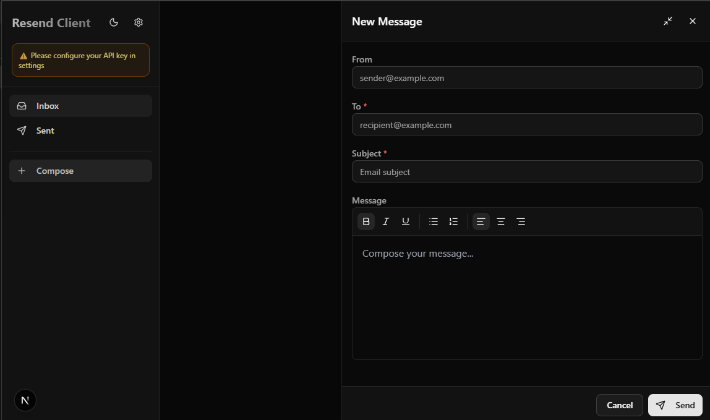

# Resend Email Client

> **⚠️ Important Notice:** This is **not** an official repository from Resend. This is a third-party project built for testing and educational purposes only. Please ensure that your usage complies with Resend's Terms of Service and API usage policies. Use at your own risk.

A beautiful and modern email client built with Next.js and shadcn/ui for managing emails using the Resend API. Designed to look and feel like a traditional email client with a sidebar navigation, inbox, sent folder, and compose functionality.



## Features

- **Email Client UI** - Beautiful sidebar-based interface similar to Gmail/Outlook
- **Settings Management** - Configure your Resend API key directly in the app (stored in localStorage)
- **Send Emails** - Send HTML or plain text emails to single or multiple recipients
- **View Sent Emails** - Browse through all your sent emails with status information
- **View Received Emails** - View emails received via webhooks (requires webhook setup)
- **Email Detail View** - Click on any email to view full details

## Prerequisites

- Node.js 18+
- pnpm (package manager)
- Resend API key ([Get one here](https://resend.com/api-keys))

## Setup

1. **Install dependencies:**

   ```bash
   pnpm install
   ```

2. **Run the development server:**

   ```bash
   pnpm dev
   ```

3. **Open your browser:**

   Navigate to [http://localhost:3000](http://localhost:3000)

4. **Configure your API key:**
   - Click the Settings icon in the top right of the sidebar
   - Enter your Resend API key from [Resend Dashboard](https://resend.com/api-keys)
   - Optionally set a default "From" email address
   - Click "Save"

## License

MIT
